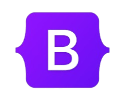
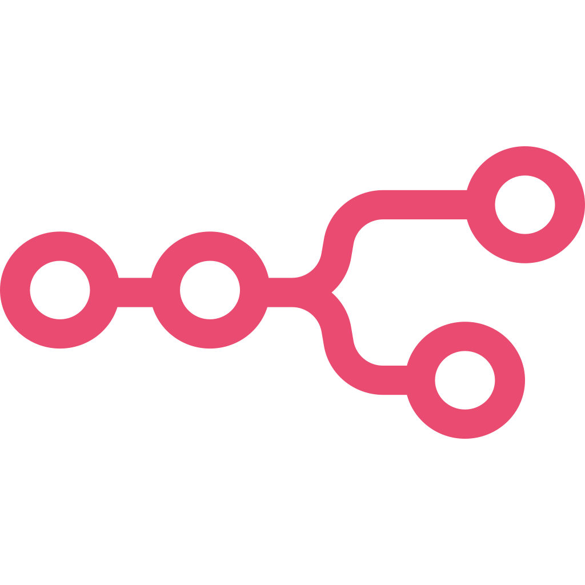

  

<h1 align="center">Hi 👋, I'm Maaz Ishtiaq</h1>
<h3 align="center">An Innovative mind building impressive Digital experiences.</h3> 

 

I am a passionate Frontend Developer. 
Skilled in HTML, CSS, JavaScript, Bootstrap, Tailwind CSS, React, and Git. 
I build clean, modern, and interactive web experiences.

 

- 🌱 I’m currently learning **Backend Development**.
- 👨‍💻 All of my projects are available at **https://github.com/maaz-ishtiaq**
- 💬 Ask me about **HTML, CSS, JavaScript, Bootstrap, Tailwind CSS, React**.
- 📫 How to reach me: **maazishtiaq285@gmail.com** OR **+92344653770**

<h3 align="center">Languages and Tools:</h3>
 

  
  
  
  
  
  
   
  
  
    
  <a>
  
  

